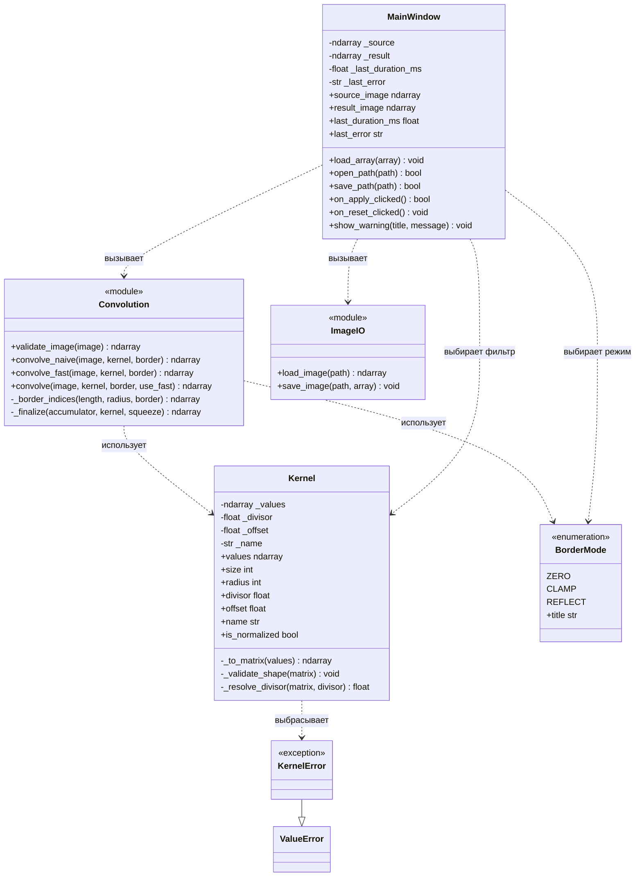

# Диаграмма классов приложения «Свёртка изображения»

Исходник в нотации Mermaid. Отрисовать можно на mermaid.live
либо встроенными средствами редактора, поддерживающего Mermaid.

```mermaid
classDiagram
    class Kernel {
        -ndarray _values
        -float _divisor
        -float _offset
        -str _name
        +values ndarray
        +size int
        +radius int
        +divisor float
        +offset float
        +name str
        +is_normalized bool
        -_to_matrix(values) ndarray
        -_validate_shape(matrix) void
        -_resolve_divisor(matrix, divisor) float
    }

    class KernelError {
        <<exception>>
    }

    class BorderMode {
        <<enumeration>>
        ZERO
        CLAMP
        REFLECT
        +title str
    }

    class Convolution {
        <<module>>
        +validate_image(image) ndarray
        +convolve_naive(image, kernel, border) ndarray
        +convolve_fast(image, kernel, border) ndarray
        +convolve(image, kernel, border, use_fast) ndarray
        -_border_indices(length, radius, border) ndarray
        -_finalize(accumulator, kernel, squeeze) ndarray
    }

    class ImageIO {
        <<module>>
        +load_image(path) ndarray
        +save_image(path, array) void
    }

    class MainWindow {
        -ndarray _source
        -ndarray _result
        -float _last_duration_ms
        -str _last_error
        +source_image ndarray
        +result_image ndarray
        +last_duration_ms float
        +last_error str
        +load_array(array) void
        +open_path(path) bool
        +save_path(path) bool
        +on_apply_clicked() bool
        +on_reset_clicked() void
        +show_warning(title, message) void
    }

    KernelError --|> ValueError
    Kernel ..> KernelError : выбрасывает
    Convolution ..> Kernel : использует
    Convolution ..> BorderMode : использует
    MainWindow ..> Convolution : вызывает
    MainWindow ..> ImageIO : вызывает
    MainWindow ..> Kernel : выбирает фильтр
    MainWindow ..> BorderMode : выбирает режим
```
